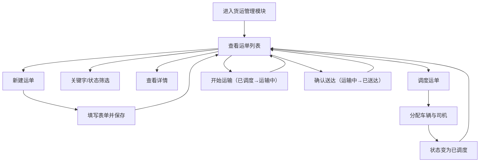

## 1. 产品概述

货运管理系统是一套面向中小型物流企业的 Web 端管理平台，用于追踪和管理货运单从创建、调度、运输到完成送达的全生命周期。核心目标是让调度员和操作员能高效地管理运单、分配车辆和司机、实时跟进运输状态。

## 2. 核心功能

### 2.1 用户角色

| 角色 | 注册方式 | 核心权限 |
|------|----------|----------|
| 调度员 | 默认内置账号 | 完整的运单管理、调度、状态流转操作权限 |

### 2.2 功能模块

1. **首页/Dashboard**：导航入口、数据概览、快速操作
2. **货运单列表**：运单列表展示、关键字搜索、状态筛选、分页
3. **新建/编辑运单**：运单表单录入、必填校验、保存提交
4. **运单调度**：分配车辆和司机、变更状态为"已调度"
5. **运单详情**：基础信息、调度信息、状态进度、费用信息
6. **状态流转**：待调度 → 已调度 → 运输中 → 已送达 的顺序状态推进

### 2.3 页面详情

| 页面名称 | 模块名称 | 功能描述 |
|----------|----------|----------|
| 首页 | 顶部导航 | 显示系统名称、货运管理入口 |
| 首页 | 数据概览卡片 | 展示待调度、运输中、已送达等运单数量统计 |
| 货运单列表 | 搜索筛选栏 | 支持按运单号/客户/货物关键字搜索，按状态下拉筛选 |
| 货运单列表 | 运单表格 | 运单号、客户、起终点、货物、车辆司机、时间、状态、费用、操作 |
| 货运单列表 | 操作列 | 查看详情、调度、编辑、状态流转按钮 |
| 新建/编辑运单 | 表单区域 | 客户、起点、终点、货物名称、重量、计划提货/到达时间、预估费用等 |
| 新建/编辑运单 | 校验提示 | 必填项红框提示、保存前校验 |
| 运单调度弹窗 | 车辆选择 | 下拉选择可用车辆 |
| 运单调度弹窗 | 司机选择 | 下拉选择可用司机 |
| 运单详情 | 基础信息卡片 | 展示运单基础信息 |
| 运单详情 | 状态时间轴 | 展示各状态节点及时间 |
| 运单详情 | 调度信息 | 显示分配的车辆和司机 |
| 运单详情 | 费用信息 | 展示预估费用和实际费用 |

## 3. 核心流程

用户进入系统后，从导航点击"货运管理"进入运单列表；点击"新建运单"填写表单并保存；回到列表搜索或筛选找到该运单；点击"调度"分配车辆和司机；然后在列表中依次点击"开始运输"和"确认送达"按钮推进状态；刷新页面后数据依然保留。

## 4. 用户界面设计

### 4.1 设计风格

- **主色调**：深蓝色 `#1e40af` 体现专业可靠的物流行业气质
- **辅助色**：青绿色 `#0d9488` 作为操作强调色
- **状态色**：待调度-橙色、已调度-蓝色、运输中-紫色、已送达-绿色
- **按钮样式**：圆角 6px，主按钮深色填充，次按钮描边
- **字体**：标题使用思源宋体/Noto Serif SC 增加稳重感，正文使用系统默认无衬线字体
- **布局风格**：左侧导航栏 + 顶部工具栏 + 卡片式内容区
- **图标**：使用 lucide-react 图标库，保持线性风格统一

### 4.2 页面设计概览

| 页面名称 | 模块名称 | UI 元素 |
|----------|----------|---------|
| 首页 | 顶部导航栏 | 深色背景、系统 logo、菜单高亮 |
| 首页 | 数据卡片 | 4 列卡片网格，数字大字 + 小标题 + 图标 |
| 运单列表 | 搜索筛选区 | 搜索框 + 状态下拉 + 新建按钮横排 |
| 运单列表 | 数据表格 | 斑马行、hover 高亮、状态带颜色标签 |
| 新建/编辑表单 | 表单卡片 | 双列表单布局、输入框带标签、必填红星标记 |
| 详情弹窗 | 内容区 | 三栏信息区 + 底部时间轴进度条 |

### 4.3 响应式设计

桌面端优先（≥1280px），列表页表格横向滚动适配小屏；表单在平板端切换为单列布局；弹窗最小宽度 480px，最大宽度 900px。

## 5. 数据持久化

- 使用 localStorage 模拟后端存储，刷新后数据不丢失
- 预置 3-5 条示例运单数据，包含不同状态
- 预置若干车辆和司机数据用于调度
