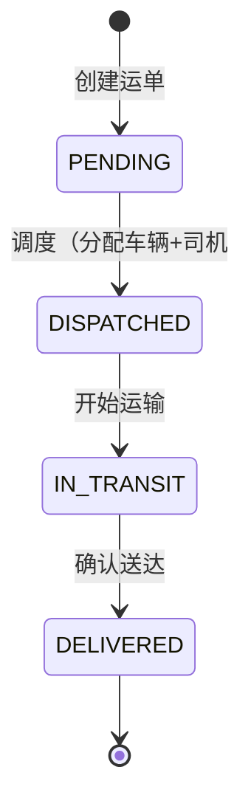

## 1. 架构设计

```mermaid
flowchart LR
    A["浏览器前端
React 前端层
" --> B["React 应用 (Vite + TS)"]
    B --> C["页面层 Pages: Home Dashboard / 运单列表 / 运单表单 / 详情弹窗"]
    B --> D["组件层: Table / 通用组件"]
    B --> E["状态管理 Zustand)
    E --> F["本地存储 localStorage)
    C --> G["模拟 API 层 mock/localStorage 持久化)
    E --> F
```

## 2. 技术说明

- **前端**: React@18 + TypeScript + Vite
- **样式**: TailwindCSS@3
- **路由**: React Router DOM
- **状态管理**: Zustand
- **图标**: lucide-react
- **数据持久化**: localStorage + 初始化 mock 数据
- **构建工具**: Vite
- **UI 组件**: 自定义组件 (自建通用组件

## 3. 路由定义

| 路由 | 用途 |
|-------|------|
| `/` | 首页 Dashboard |
| `/freight` | 货运单列表页 |
| `/freight/new` | 新建货运单 |
| `/freight/:id/edit` | 编辑货运单 |

## 4. 数据模型

### 4.1 实体关系

```mermaid
erDiagram
    FREIGHT_ORDER {
        string id PK "运单ID
        string orderNo "运单号"
        string customer "客户名称"
        string origin "起点"
        string destination "终点"
        string cargoName "货物名称"
        number cargoWeight "货物重量(吨)"
        string vehicleId FK "车辆ID"
        string driverId FK "司机ID"
        Date plannedPickupTime "计划提货时间"
        Date plannedArrivalTime "计划到达时间"
        string status "状态"
        number estimatedFee "预估费用"
        number actualFee "实际费用"
        Date createdAt "创建时间"
        Date updatedAt "更新时间"
    }
    VEHICLE {
        string id PK "车辆ID"
        string plateNumber "车牌号"
        string model "车型"
        number capacity "载重(吨)"
    }
    DRIVER {
        string id PK "司机ID"
        string name "姓名"
        string phone "电话"
    }
    STATUS_LOG {
        string id PK
        string orderId FK "运单ID"
        string status "状态"
        string remark "备注"
        Date createdAt "时间"
    }
```

### 4.2 状态枚举

```typescript
enum FreightStatus {
  PENDING = 'pending',      // 待调度
  DISPATCHED = 'dispatched', // 已调度
  IN_TRANSIT = 'in_transit', // 运输中
  DELIVERED = 'delivered'  // 已送达
}

interface FreightOrder {
  id: string;
  orderNo: string;
  customer: string;
  origin: string;
  destination: string;
  cargoName: string;
  cargoWeight: number;
  vehicleId?: string;
  driverId?: string;
  plannedPickupTime: string;
  plannedArrivalTime: string;
  status: FreightStatus;
  estimatedFee: number;
  actualFee?: number;
  statusLogs: StatusLog[];
  createdAt: string;
  updatedAt: string;
}

interface Vehicle {
  id: string;
  plateNumber: string;
  model: string;
  capacity: number;
}

interface Driver {
  id: string;
  name: string;
  phone: string;
}

interface StatusLog {
  id: string;
  status: FreightStatus;
  time: string;
  remark?: string;
}
```

## 5. 目录结构

```
src/
├── components/          # 通用组件
│   ├── Layout.tsx     # 布局组件（侧边栏+内容区）
│   ├── StatusTag.tsx # 状态标签
│   ├── Modal.tsx     # 通用弹窗
│   └── Table.tsx     # 通用表格
├── pages/            # 页面
│   ├── Home.tsx      # 首页
│   ├── freight/
│   │   ├── List.tsx       # 运单列表
│   │   ├── Form.tsx        # 新建/编辑表单
│   │   └── DetailModal.tsx # 详情弹窗
│   │   └── DispatchModal.tsx # 调度弹窗
├── store/           # Zustand store
│   └── useFreightStore.ts
├── types/           # TS 类型定义
│   └── index.ts
├── utils/           # 工具函数
│   ├── storage.ts       # localStorage 封装
│   └── mock.ts         # mock 数据
├── App.tsx          # 根组件
├── main.tsx          # 入口文件
└── index.css        # 全局样式
```

## 6. 状态流转规则



- 禁止跳级：PENDING 不能直接到 IN_TRANSIT 或 DELIVERED；DISPATCHED 不能直接到 DELIVERED
- 已送达状态为终态，不可回退
